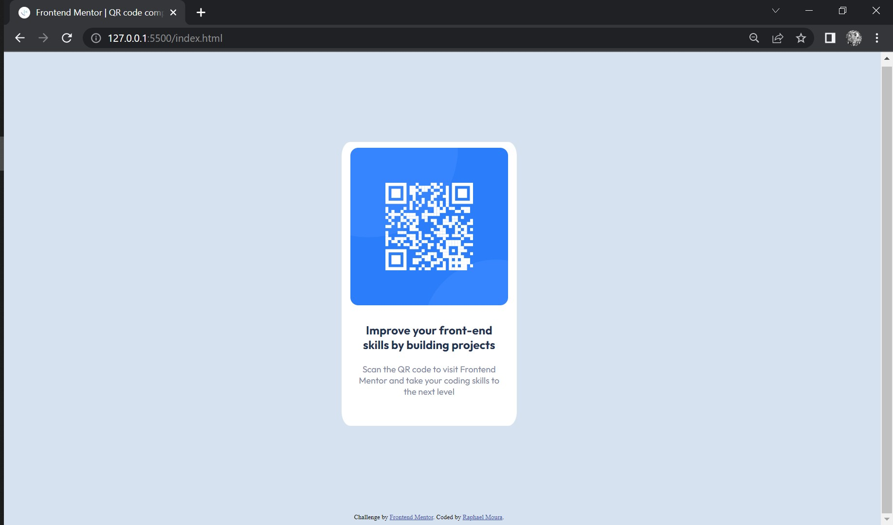

# Frontend Mentor - QR code component solution

This is a solution to the [QR code component challenge on Frontend Mentor](https://www.frontendmentor.io/challenges/qr-code-component-iux_sIO_H).

## Table of contents

  - [Screenshot](./design/desktop-design.jpg)
  - [Links](#links)
- [My process](#my-process)
  - [Built with](#built-with)
- [Author](#author)

### Screenshot

### Links

- Solution URL: (https://your-solution-url.com)

## My process
  This is a easy-to-develop project to use basic CSS and HTML content.

### Built with

- Semantic HTML5 markup
- CSS custom properties
- Flexbox

## Author

- Frontend Mentor - [@RaphaelMoura11](https://www.frontendmentor.io/profile/RaphaelMoura11)
- Github - [@RaphaelMoura11](https://github.com/RaphaelMoura11)